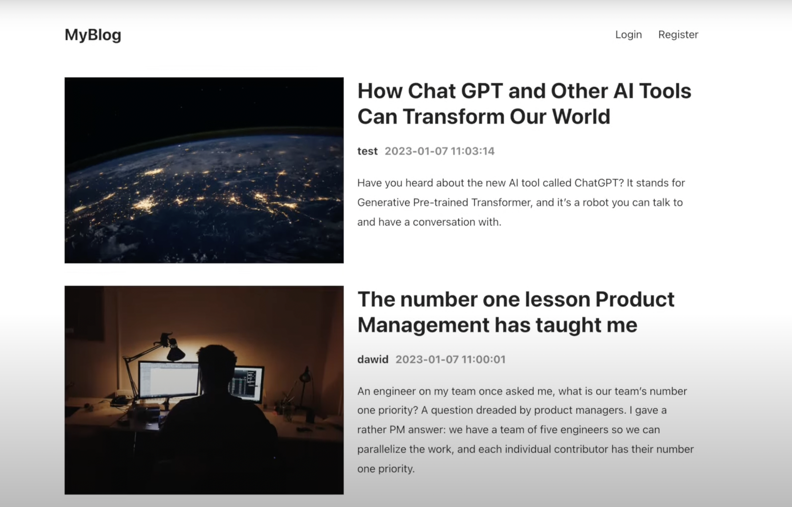

Blog App

_Created a MERN Stack Blog application_
- You can create your blogs and post them within your profile you can also view the blogs posted by other users view them and find the information of the author
- Only the author of the post can edit the post
- Technologies used:
* MongoDB
* Express
* React
* Node
* JWT (JSON Web Tokens)
  

To run this project follow these steps:
* make sure you have yarn installed
* git clone
* cd client
* npm i
* yarn start
